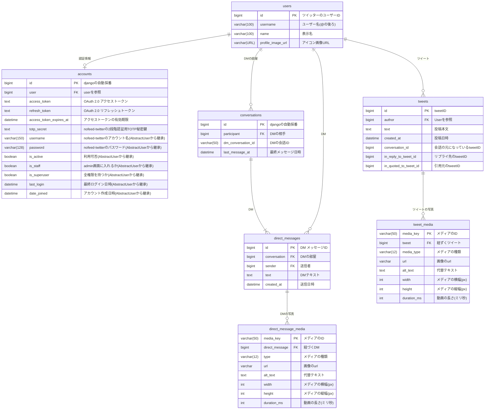

# データベース設計

## 設計方針

- PKをDjangoの自動採番によって取得する場合もほかテーブルと記述を揃えるため、明示的にPKを指定しています。
- システム構造上リツイートは見れない設計にしているので、リツイート先のIDを保存するカラムは作成してません。
- DM部屋のIDは 【ユーザーid(19桁)-ユーザーid(19桁)】の形式で作成されます。
- DM部屋のPKは自分と相手とで同じIDを参照するためPKにすることはできないため、自動採番で取得した値をPKにしています。
- DMにはグループDMという機能がありますが、このシステムではそれに対応させていないため関連するテーブル、カラムは排除しています。
- api利用料金はdbには保存せず、ブラウザのlocalStorageに保存します。
- dmのメディアテーブルとツイートのメディアテーブルを分けている理由は、別々のアプリでモデルを定義するためです。
- 外部キーのon_deleteは基本的にSET_NULLを採用しています。ユーザー情報が削除されてもツイートやDMまで連鎖削除するメリットがほとんどなく、データ量も少ないため残しておいて問題ないと判断しました。
- アクセストークンやTOTP秘密鍵は平文で保存します。DBが流出した場合でも、APIの利用上限はX Developer Portal側で制御されており、その変更にはXアカウントへのログイン（2段階認証あり）が必要なため、実害は限定的と判断しました。リスクが変わった場合は再検討します。
- 逆参照名（related_name）はデフォルトと同じになる場合でも、すべてのリレーションフィールドに明示的に指定します。統一性と可読性を優先するためです。
- AbstractUserから継承されるフィールドのうち、first_name・last_name・email・groups・user_permissionsはこのアプリでは使用しないため、ER図には記載していません。

## ER図

