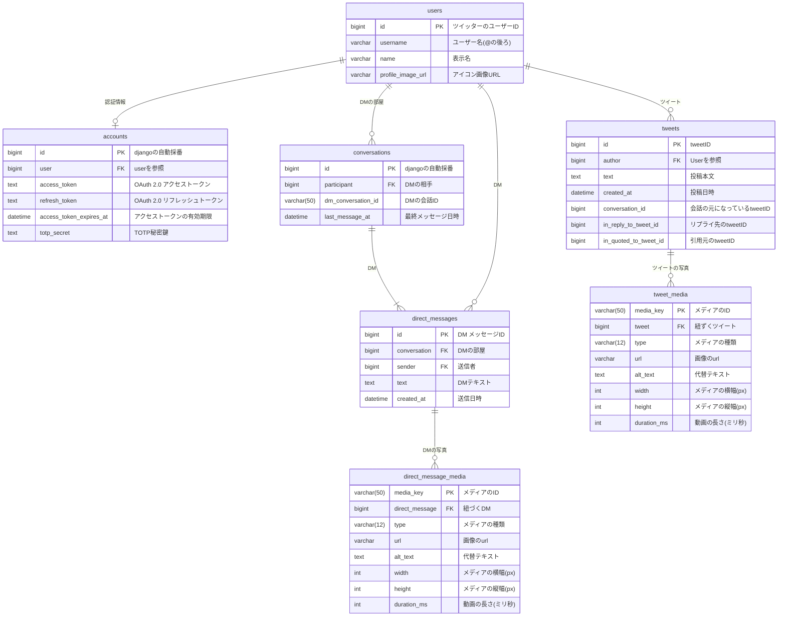

# データベース設計

## 設計方針

- PKをDjangoの自動採番によって取得する場合もほかテーブルと記述を揃えるため、明示的にPKを指定しています。
- システム構造上リツイートは見れない設計にしているので、リツイート先のIDを保存するカラムは作成してません。
- DM部屋のIDは 【ユーザーid(19桁)-ユーザーid(19桁)】の形式で作成されます。
- DM部屋のPKは自分と相手とで同じIDを参照するためPKにすることはできないため、自動採番で取得した値をPKにしています。
- DMにはグループDMという機能がありますが、このシステムではそれに対応させていないため関連するテーブル、カラムは排除しています。
- api利用料金はdbには保存せず、ブラウザのlocalStorageに保存します。
- dmのメディアテーブルとツイートのメディアテーブルを分けている理由は、別々のアプリでモデルを定義するためです。

## ER図



## Django

```python
class User(models.Model):
    """ユーザー情報"""
    id = models.BigIntegerField(primary_key=True, help_text="TwitterのユーザーID")
    username = models.CharField(max_length=50, help_text="ユーザー名（@の後ろ）")
    name = models.CharField(max_length=100, help_text="表示名")
    profile_image_url = models.URLField(blank=True, null=True, help_text="アイコン画像URL")

    class Meta:
        db_table = "users"


class Account(models.Model):
    """nofeed-Twitter利用者の認証・トークン管理用"""
    id = models.BigAutoField(primary_key=True)
    user = models.OneToOneField(User, on_delete=models.CASCADE, help_text="Userテーブルへの参照")
    access_token = models.TextField(help_text="OAuth 2.0 アクセストークン")
    refresh_token = models.TextField(blank=True, null=True, help_text="OAuth 2.0 リフレッシュトークン")
    access_token_expires_at = models.DateTimeField(blank=True, null=True, help_text="アクセストークンの有効期限")
    totp_secret = models.TextField(blank=True, null=True, help_text="TOTP秘密鍵（暗号化）")

    class Meta:
        db_table = "accounts"


class Tweet(models.Model):
    """投稿"""
    id = models.BigIntegerField(primary_key=True, help_text="tweetID")
    author = models.ForeignKey(User, on_delete=models.CASCADE, related_name="tweets", help_text="投稿者")
    text = models.TextField(help_text="投稿本文")
    created_at = models.DateTimeField(help_text="投稿日時")
    conversation_id = models.BigIntegerField(blank=True, null=True, help_text="会話ID（スレッド管理用）")
    in_reply_to_tweet_id = models.BigIntegerField(blank=True, null=True, help_text="リプライ先のTweet ID")
    in_quoted_to_tweet_id = models.BigIntegerField(blank=True, null=True, help_text="引用先のTweet ID")

    class Meta:
        db_table = "tweets"

class TweetMedia(models.Model):
    """ツイートのメディア情報（画像・動画）"""
    class MediaType(models.TextChoices):
        PHOTO = "photo" , "写真"
        VIDEO = "video" , "動画"
        GIF = "animated_gif" , "gif画像"

    media_key = models.CharField(max_length=50, primary_key=True, help_text="Xのmedia_key")
    tweet = models.ForeignKey(tweet, on_delete=models.CASCADE, blank=True, null=True, related_name="media",help_text="紐づく投稿")
    type = models.CharField(max_length=12, choices=MediaType.choices, help_text="メディアの種類")
    url = models.URLField(blank=True, null=True, help_text="メディアのURL")
    alt_text = models.TextField(blank=True, null=True, help_text="代替テキスト")
    width = models.IntegerField(blank=True, null=True, help_text="メディアの横幅(px)")
    height = models.IntegerField(blank=True, null=True, help_text="メディアの縦幅(px)")
    duration_ms = models.IntegerField(blank=True, null=True, help_text="動画の場合の長さ（ミリ秒）")

    class Meta:
        db_table = "tweet_media"


class Conversation(models.Model):
    """DMの会話単位"""
    id = models.BigAutoField(primary_key=True)
    participant = models.ForeignKey(User, on_delete=models.CASCADE, related_name="conversations", help_text="DMの相手")
    dm_conversation_id = models.CharField(max_length=50, help_text="dmの会話id")
    last_message_at = models.DateTimeField(blank=True, null=True, help_text="最後のメッセージ日時")

    class Meta:
        db_table = "conversations"


class DirectMessage(models.Model):
    """DMメッセージ"""
    id = models.BigIntegerField(primary_key=True, help_text="DMメッセージID")
    conversation = models.ForeignKey(Conversation, on_delete=models.CASCADE, related_name="messages", help_text="DMの部屋")
    sender = models.ForeignKey(User, on_delete=models.CASCADE, related_name="sent_messages", help_text="送信者")
    text = models.TextField(blank=True, null=True, help_text="メッセージ本文")
    created_at = models.DateTimeField(help_text="送信日時")

    class Meta:
        db_table = "direct_messages"


class DirectMessageMedia(models.Model):
    """DMメディア情報（画像・動画）"""
    class MediaType(models.TextChoices):
        PHOTO = "photo" , "写真"
        VIDEO = "video" , "動画"
        GIF = "animated_gif" , "gif画像"

    media_key = models.CharField(max_length=50, primary_key=True, help_text="Xのmedia_key")
    direct_message = models.ForeignKey(DirectMessage, on_delete=models.CASCADE, blank=True, null=True, related_name="media", help_text="紐づくDM")
    type = models.CharField(max_length=12, choices=MediaType.choices, help_text="メディアの種類")
    url = models.URLField(blank=True, null=True, help_text="メディアのURL")
    alt_text = models.TextField(blank=True, null=True, help_text="代替テキスト")
    width = models.IntegerField(blank=True, null=True, help_text="メディアの横幅(px)")
    height = models.IntegerField(blank=True, null=True, help_text="メディアの縦幅(px)")
    duration_ms = models.IntegerField(blank=True, null=True, help_text="動画の場合の長さ（ミリ秒）")

    class Meta:
        db_table = "media"
```
