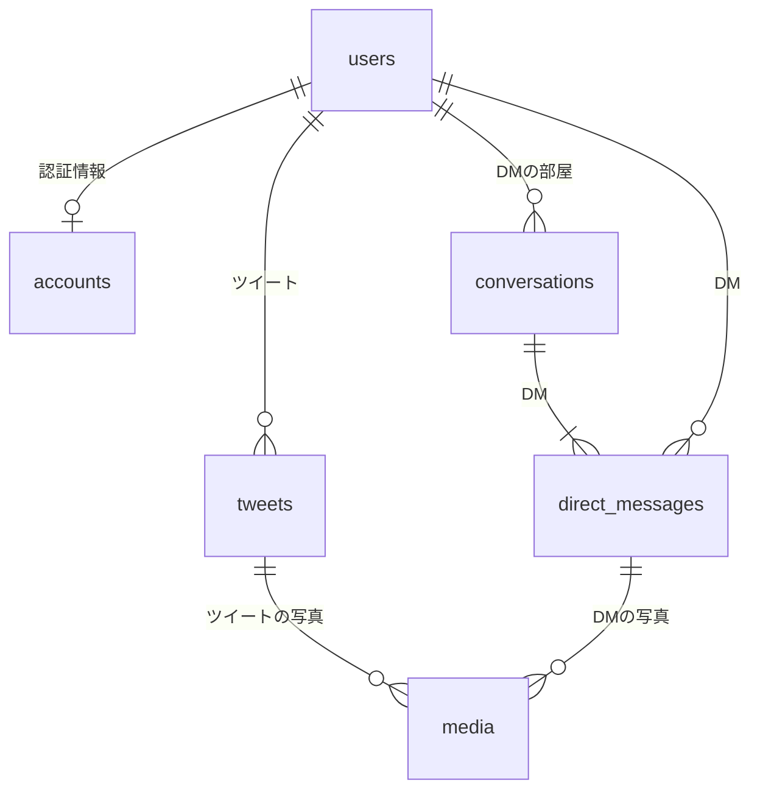

# データベース設計

## マーメイド記法



## Django

```python
class User(models.Model):
    """ユーザー情報"""
    id = models.BigIntegerField(primary_key=True, help_text="TwitterのユーザーID")
    username = models.CharField(max_length=50, help_text="ユーザー名（@の後ろ）")
    name = models.CharField(max_length=100, help_text="表示名")
    profile_image_url = models.URLField(blank=True, null=True, help_text="アイコン画像URL")

    class Meta:
        db_table = "users"


class Account(models.Model):
    """nofeed-Twitter利用者の認証・トークン管理用"""
    id = models.BigAutoField(primary_key=True) # 他テーブルと記述を揃えるため、明示的にpkを指定
    user = models.OneToOneField(User, on_delete=models.CASCADE, help_text="Userテーブルへの参照")
    access_token = models.TextField(help_text="OAuth 2.0 アクセストークン")
    refresh_token = models.TextField(blank=True, null=True, help_text="OAuth 2.0 リフレッシュトークン")
    access_token_expires_at = models.DateTimeField(blank=True, null=True, help_text="アクセストークンの有効期限")
    totp_secret = models.TextField(blank=True, null=True, help_text="TOTP秘密鍵（暗号化）")

    class Meta:
        db_table = "accounts"


class tweet(models.Model):
    """投稿"""
    id = models.BigIntegerField(primary_key=True, help_text="tweetID")
    author = models.ForeignKey(User, on_delete=models.CASCADE, related_name="tweets", help_text="投稿者")
    text = models.TextField(help_text="投稿本文")
    created_at = models.DateTimeField(help_text="投稿日時")
    conversation_id = models.BigIntegerField(blank=True, null=True, help_text="会話ID（スレッド管理用）")
    in_reply_to_tweet_id = models.BigIntegerField(blank=True, null=True, help_text="リプライ先のTweet ID")
    referenced_tweet_type = models.CharField(max_length=20, blank=True, null=True, help_text="replied_to / quoted / retweeted")

    class Meta:
        db_table = "tweets"


class Conversation(models.Model):
    """DMの会話単位"""
    id = models.BigAutoField(primary_key=True) # 他テーブルと記述を揃えるため、明示的にpkを指定
    dm_conversation_id = models.CharField(max_length=50, help_text="dmの会話id") # DMの会話は２人で共有するためPKにできない
    participant = models.ForeignKey(User, on_delete=models.CASCADE, related_name="conversations", help_text="DMの相手")
    last_message_at = models.DateTimeField(blank=True, null=True, help_text="最後のメッセージ日時")

    class Meta:
        db_table = "conversations"


class DirectMessage(models.Model):
    """DMメッセージ"""
    id = models.BigIntegerField(primary_key=True, help_text="DMイベントID")
    conversation = models.ForeignKey(Conversation, on_delete=models.CASCADE, related_name="messages", help_text="DMの部屋")
    sender = models.ForeignKey(User, on_delete=models.CASCADE, related_name="sent_messages", help_text="送信者")
    text = models.TextField(blank=True, null=True, help_text="メッセージ本文")
    created_at = models.DateTimeField(help_text="送信日時")
    event_type = models.CharField(max_length=30, default="MessageCreate", help_text="MessageCreate など")

    class Meta:
        db_table = "direct_messages"


class Media(models.Model):
    """メディア情報（画像・動画）"""
    media_key = models.CharField(max_length=50, primary_key=True, help_text="Xのmedia_key")
    type = models.CharField(max_length=20, help_text="photo / video / animated_gif")
    url = models.URLField(blank=True, null=True, help_text="メディアのURL")
    alt_text = models.TextField(blank=True, null=True, help_text="代替テキスト")
    width = models.IntegerField(blank=True, null=True)
    height = models.IntegerField(blank=True, null=True)
    duration_ms = models.IntegerField(blank=True, null=True, help_text="動画の場合の長さ（ミリ秒）")
    tweet = models.ForeignKey(tweet, on_delete=models.CASCADE, blank=True, null=True, related_name="media", help_text="紐づく投稿")
    direct_message = models.ForeignKey(DirectMessage, on_delete=models.CASCADE, blank=True, null=True, related_name="media", help_text="紐づくDM")

    class Meta:
        db_table = "media"
```
